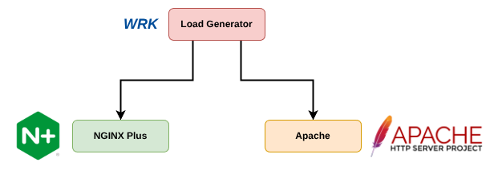

# main steps

## Version Matrix

| Component | Version | Release |
|----------|---------|---------------|
| Operating System | Ubuntu 24.04 LTS Server | - |
| NGINX Plus | 1.29.3 | nginx-plus-r36-p1 |
| Apache2 | 2.4.58 | - |
| WRK | 4.2.0 | - |

## Server Specification

| server_name | core | ram |
|----------|---------|---------------|
| Load_Generator | 8 | 16GiB |
| NGINX_Plus_Server | 8 | 16GiB |
| Apache_Server | 8 | 16GiB |

## Deployment Diagram


### Apache
install
config
exporter


## Monitoring and Visulizaition

### Prometheus


### Grafana

## Results
### NGINX Plus [nginx/1.29.3 (nginx-plus-r36-p1)]
``` Log
wrk -t4 -c100 -d300s --latency http://10.110.121.85
Running 5m test @ http://10.110.121.85
  4 threads and 100 connections
  Thread Stats   Avg      Stdev     Max   +/- Stdev
    Latency     4.31ms    3.59ms 131.65ms   98.23%
    Req/Sec     6.02k   627.62    10.28k    84.88%
  Latency Distribution
     50%    3.72ms
     75%    4.52ms
     90%    5.79ms
     99%    8.91ms
  7193149 requests in 5.00m, 2.12GB read
Requests/sec:  23972.00
Transfer/sec:      7.25MB
```

### Apache [2.4.58]
``` Log
wrk -t4 -c100 -d300s --latency http://10.110.121.175
Running 5m test @ http://10.110.121.175
  4 threads and 100 connections
  Thread Stats   Avg      Stdev     Max   +/- Stdev
    Latency     3.93ms    1.19ms  58.85ms   77.59%
    Req/Sec     6.26k   501.40     9.76k    77.93%
  Latency Distribution
     50%    3.63ms
     75%    4.12ms
     90%    5.65ms
     99%    7.06ms
  7479000 requests in 5.00m, 2.15GB read
  Socket errors: connect 0, read 124210, write 0, timeout 0
Requests/sec:  24924.08
Transfer/sec:      7.35MB
```

